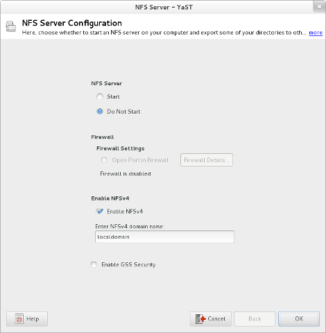

YaST NFS Server Module
======================

The YaST NFS Server module manages configuration of an
[NFS](https://en.wikipedia.org/wiki/Network_File_System) server. It's a part of
[YaST](https://en.opensuse.org/Portal:YaST) — installation and configuration
tool for [openSUSE](https://www.opensuse.org/) and [SUSE Linux
Enterprise](https://www.suse.com/products/server/) (SLE).

  

Features
--------

  * NFSv3
  * NFSv4

Installation
------------

To install the latest stable version on openSUSE or SLE, use zypper:

    $ sudo zypper install yast2-nfs-server

Running
-------

To run the module, use the following command:

    $ sudo /usr/sbin/yast2 nfs-server

This will run the module in text mode. For more options, including running in
your desktop environment, see section on [running
YaST](https://en.opensuse.org/SDB:Starting_YaST) in the YaST documentation.

Documentation
-------------

User-level documentation for this module is available in the
[openSUSE Reference documentation][user]. See also
[general YaST documentation](https://en.opensuse.org/Portal:YaST).

[user]: http://activedoc.opensuse.org/book/opensuse-reference/chapter-18-sharing-file-systems-with-nfs

Developer documentation specific for this module is in the [doc](doc)
directory.

Development
-----------

This module is developed as part of YaST. See
[YaST development documentation](
  https://en.opensuse.org/openSUSE:YaST_development)
for information about [YaST architecture](
  https://en.opensuse.org/openSUSE:YaST:_Architecture_Overview),
[development environment](
https://en.opensuse.org/openSUSE:YaST:_Preparing_the_Development_Environment)
and other development-related topics.

To get the source code, clone the GitHub repository:

    $ git clone https://github.com/yast/yast-nfs-server.git

Alternatively, you can fork the repository and clone your fork. This is most
useful if you plan to contribute into the project.

Before doing anything useful with the code, you need to setup a development
environment. Fortunately, this is quite simple:

    $ sudo zypper install yast2-devtools

To run the module from the source code, use the `run` Rake task:

    $ rake run

To run the testsuite, use the `test` Rake task:

    $ rake test

For a complete list of tasks, run `rake -T`.

Before submitting any change please read our [contribution
guidelines](CONTRIBUTING.md).

If you have any question, feel free to ask at the [development mailing
list](http://lists.opensuse.org/yast-devel/) or at the
[#yast](https://webchat.freenode.net/?channels=%23yast) IRC channel on freenode.
We'll do our best to provide a timely and accurate answer.
